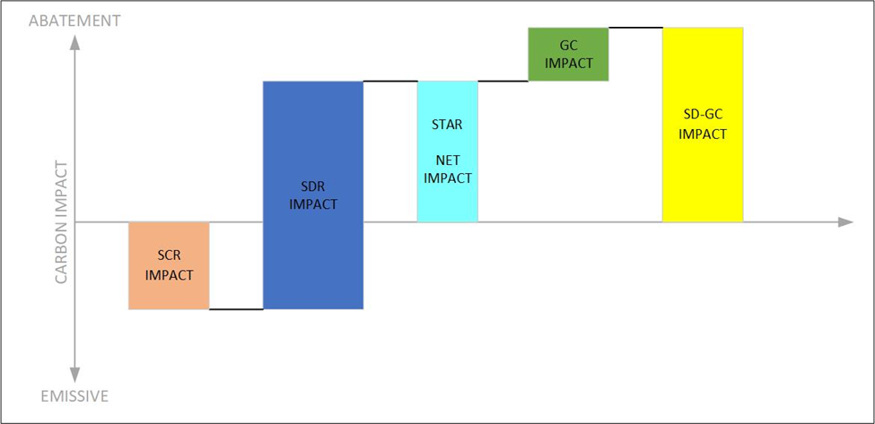

---
layout:
  title:
    visible: true
  description:
    visible: true
  tableOfContents:
    visible: true
  outline:
    visible: true
  pagination:
    visible: true
---

# Introduction

<figure><figcaption></figcaption></figure>

## Enabling Easy Settlement of Storage Forward Contracts

Like REC agreements in renewable generation, corporate buyers can enter a long-term contract for energy storage's time-shifting and carbon impact using Power Emissions Certificates (PECs). Storage can now be incorporated into various corporate procurement strategies:

* For emissionality, a carbon price will incentivize battery operation to co-optimize dispatch logic to capture carbon revenue. An emissionality-index PEC agreement would be a simple way of incorporating energy storage into corporate procurement.&#x20;
* For 24/7 hourly matching, in some geographies, the supply of carbon-free energy (CFE) can be limited at certain hours of the day. A premium price will be given to hourly PECs that have been time-shifted from hours of high CFE supply to hours of low CFE supply.

## The PEC Approach

The goal is to create a market instrument enabling easy settlement of a forward contract for energy storage time shifting and carbon shifting based on marginal emissions factors and power meter data. This market instrument must be useful for corporate carbon accounting and reporting.

There are two main approaches:

1. Energy attribute certificates based on inventory accounting, such as RECs.
2. Carbon offsets based on consequential accounting.

The [PEC Alliance (PECA)](http://www.pec-alliance.org) is a collaborative initiative focused on using Power Emissions Certificates (PECs), which are RECs enhanced with marginal emissions and timestamps, to achieve the goal of promoting sustainable energy practices. By enhancing the value of RECs, PECA is driving the adoption of PECs in the energy industry.
