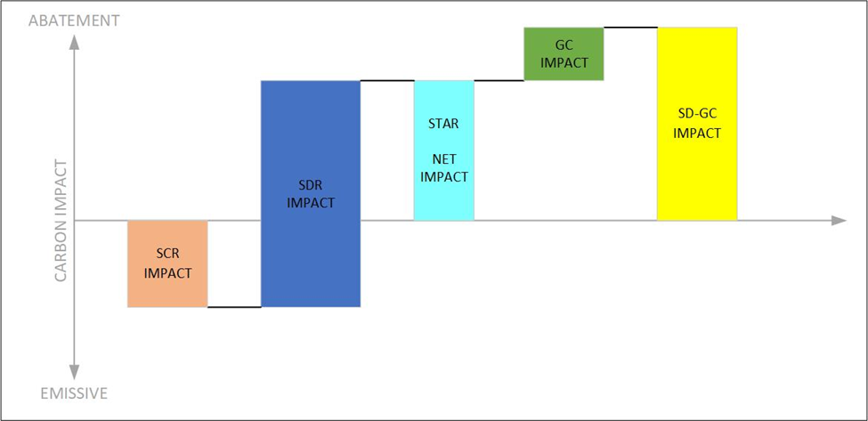

# The Imperative for Granular Tracking and Energy Time-Shifting

The global energy transition necessitates increasingly sophisticated approaches to corporate decarbonization and renewable energy procurement. Traditional methods, while foundational, are proving insufficient to meet the demands for greater transparency, impact, and alignment with the physical realities of a grid integrating high levels of CFE. This section examines the evolving landscape of decarbonization strategies, the limitations of conventional instruments, the critical role of energy storage, and the resulting market gap that necessitates innovative solutions, such as Storage Time Allocation Records (STARs).

## The Evolution of Corporate Decarbonization Strategies

For years, corporate sustainability efforts related to electricity consumption primarily relied on matching annual energy usage with an equivalent volume of Renewable Energy Certificates (RECs) or Guarantees of Origin (GOs). While instrumental in driving initial investment in renewable generation, this annual matching approach faces growing scrutiny for its potential disconnect from real-time grid operations and emissions.1 A company claiming 100% renewable energy based on annual certificates might still rely heavily on fossil fuels during hours when its contracted renewable sources are not generating.1

This realization, coupled with increasing pressure from investors, customers, and regulators for more credible and impactful climate action, has spurred the development of more granular strategies 2:

* **24/7 Carbon-Free Energy (CFE):** This approach demands that every hour of an organization's electricity consumption is matched with CFE generation procured from the same grid region within that same hour.1 Pioneered by technology companies like Google and Microsoft 18, 24/7 CFE aims to directly address the intermittency of CFE and ensure that corporate demand drives investment in a truly decarbonized grid, around the clock.4 Achieving this requires high-resolution temporal data and mechanisms to manage supply-demand mismatches.4
* **Emissionality (Impact Accounting):** This strategy prioritizes maximizing the _carbon reduction impact_ of clean energy procurement. Instead of solely focusing on matching consumption volume, it seeks to deploy clean energy resources during times and in locations where they displace the highest amount of fossil fuel generation from the grid.1 This often involves utilizing Marginal Emissions Rate (MER) data, which reflects the emissions intensity of the power plant operating "on the margin" to meet the next increment of demand.27 The goal is to achieve the greatest possible _avoided emissions_ per MWh of clean energy procured, which requires sophisticated temporal and locational optimization.16

While 24/7 CFE prioritizes temporal matching, emissionality prioritizes maximizing CO₂e avoidance; both represent a significant departure from annual accounting. They fundamentally depend on access to granular, time-stamped energy attribute data and effective strategies for managing the temporal dimension of energy supply and demand. This shared need highlights the inadequacy of traditional EACs and underscores the necessity for new market instruments.

## Limitations of Conventional Energy Attribute Certificates (EACs)

Conventional EACs (RECs in North America, GOs in Europe) were designed for a different era, primarily to track compliance with Renewable Portfolio Standards (RPS) and facilitate voluntary green power claims on an aggregated annual or monthly basis.31 Their limitations become apparent when applied to the demands of hourly matching and impact-based accounting:

* **Lack of Temporal Granularity:** Standard EACs typically only specify the vintage year or month of generation, lacking the hourly or sub-hourly timestamps required for 24/7 CFE matching or precise emissionality calculations.1 This temporal ambiguity allows for claims that may not reflect the actual energy mix consumed in specific hours.3
* **Inability to Track Storage:** The core function of energy storage is time-shifting, yet traditional EACs offer no standardized way to track attributes through this process. There is no mechanism to verifiably link a REC generated at noon to energy discharged from a battery at 8 PM, nor to account for the inherent energy losses (round-trip inefficiency) in the storage cycle.5 This gap creates significant risks of double counting – claiming the attribute both at the point of generation and again at the point of discharge – and undermines the credibility of storage-enabled CFE claims.5
* **Geographical Ambiguity:** Many EAC systems permit the purchase and retirement of certificates generated in grid regions physically disconnected from the point of consumption.5 While potentially supporting renewable development broadly, this geographical decoupling weakens claims of using specific renewable energy and reduces the incentive to develop resources that directly address local grid needs.13 While STARs focus on the temporal dimension, the underlying GC framework, often aligned with standards like EnergyTag, typically incorporates stricter geographical matching rules.12

The fundamental issue extends beyond merely adding a timestamp to an EAC. Energy storage actively _transforms_ the temporal attribute of energy. Therefore, a robust system requires not just granular certificates (such as GCs) but a specific, verifiable mechanism to govern the modification of the time attribute as energy flows through storage, ensuring physical realities like losses are accounted for and preventing the duplication of claims.

## The Pivotal Role of Energy Storage

Energy storage technologies, particularly battery energy storage systems (BESS), are emerging as indispensable components of the modern, decarbonizing power grid.7 Their ability to absorb energy during periods of surplus and inject it back during periods of deficit provides critical flexibility:

* **CFE Integration:** Storage smooths the inherent variability of wind and solar power, mitigating curtailment, reducing ramp requirements for thermal plants, and allowing higher penetrations of renewables onto the grid.11
* **Enabling 24/7 CFE:** Storage directly addresses the temporal gaps inherent in CFE-heavy portfolios. By storing excess CFE generated during sunny or windy periods and discharging it during nighttime or calm periods, storage allows buyers to achieve continuous, hour-by-hour matching of their load with CFE resources.3
* **Facilitating Emissionality:** Storage enables the strategic shifting of clean energy from low-carbon-impact periods (low MER) to high-carbon-impact periods (high MER), thereby maximizing the displacement of fossil fuel generation and increasing the overall carbon reduction value of the procured CFE.28
* **Grid Services:** Beyond time-shifting energy attributes for consumers, storage provides valuable services directly to the grid, including frequency regulation, voltage support, spinning reserves, capacity provision, and transmission/distribution deferral.40
* **Market Growth:** Driven by dramatic cost reductions, particularly for lithium-ion batteries 39, and supportive policies like the US Inflation Reduction Act (IRA) 51, the deployment of grid-scale storage is accelerating rapidly.39

While storage offers this multitude of benefits, the specific value derived from the _verifiable time-shifting of clean energy attributes_ for corporate CFE or emissionality goals remains largely uncaptured by existing market mechanisms. Current markets primarily compensate storage for energy arbitrage, capacity, or ancillary services based on grid needs 40, not for guaranteeing the temporal origin of specific environmental attributes delivered to an end-user. This disconnect represents a significant untapped potential for storage to contribute more directly and verifiably to corporate decarbonization efforts.

## Identifying the Market Gap for Storage Attribute Tracking

<figure><figcaption></figcaption></figure>

The convergence of advanced corporate decarbonization goals, the limitations of conventional EACs, and the crucial role of energy storage highlights a clear market gap: the absence of a standardized, transparent, liquid, and auditable instrument for trading the time-shifting attribute of stored clean energy.

Current practices rely on inadequate workarounds:

* **Storage Tolling Agreements:** These bilateral contracts grant a buyer the right to storage capacity but are complex, bespoke, and carry significant operational and market risks for the buyer, as they are inherently non-standardized, limiting scalability and market development.9
* **Manual Tracking:** Relying on spreadsheets and disparate meter data is cumbersome, prone to errors, lacks transparency, and is difficult to audit credibly.

The energy market requires storage that REC and GO systems provide for renewable generation: a robust, registry-based infrastructure ensuring clear title transfer, verifiable claims, standardized settlement, and market liquidity. While initiatives like EnergyTag are defining standards for Granular Certificates (GCs) and incorporating basic storage records (Storage Charge Records - SCRs, Storage Discharge Records - SDRs, and Storage-Discharge GCs - SD-GCs) 11, these standards do not inherently create a _tradable commodity_ representing the time-shifting service itself. Registries like M-RETS and PJM GATS are adding hourly capabilities 58, but a dedicated instrument is needed to unlock a market for the storage attribute.

This gap is not merely technical; it is also commercial in nature. Without a way to commoditize and trade the time-shifting service, its value remains difficult to price and procure efficiently. Storage operators lack a clear market signal for optimizing dispatch towards attribute time-shifting, and buyers lack a simple, low-risk way to procure this capability. STARs are explicitly proposed to fill this void, creating a dedicated market instrument for the temporal value storage provided within the clean energy attribute ecosystem.

